<div align="center">



<br/>

[](https://nodejs.org/)
[](https://js.langchain.com/)
[](https://ai.google.dev/)
[](https://nodejs.org/api/esm.html)
[](https://opensource.org/licenses/ISC)

<br/>

> **✦ AI Chain Experimentation · Google Gemini Integration · Prompt Engineering ✦**

</div>

---

## ⚠️ Practice Repository Disclaimer

> [!CAUTION]
> **This is a personal practice and learning repository.**
>
> - 🚫 **Not production-ready** — code is written for experimentation and exploration only.
> - 🔬 **Work in progress** — structure and features may change without notice.
> - 📚 **Educational purpose** — following along with LangChain.js concepts and patterns.
> - 🔑 **Never commit secrets** — requires a `.env` file with real API keys (excluded via `.gitignore`).

---

## ✨ Features

- **LangChain.js + Google Gemini** — Integrates `@langchain/google-genai` with the `gemini-2.0-flash` model
- **Prompt Templates** — Demonstrates `PromptTemplate.fromTemplate` for structured, reusable prompts
- **Chain Composition** — Uses LangChain's `.pipe()` pattern to build AI chains from modular components
- **Multiple Invocation Patterns** — Explores direct model calls, chained invocations, and template-only pipelines
- **ES Modules** — Written in native ESM (`"type": "module"`) for modern JavaScript practices
- **Environment Config** — Secure API key management via `dotenv`

---

## 🛠 Tech Stack

| Layer | Technology | Version |
|-------|-----------|---------|
| **Runtime** | Node.js | 20+ |
| **Language** | JavaScript (ES Modules) | ES2022+ |
| **AI Framework** | LangChain.js Core | `^1.1.2` |
| **LLM Provider** | LangChain Google GenAI | `^2.0.2` |
| **Model** | Google Gemini 2.0 Flash | `gemini-2.0-flash` |
| **Config** | dotenv | `^17.2.3` |

---

## 🚀 Getting Started

### Prerequisites

- **Node.js** `v20` or higher
- A **Google AI Studio API key** (Gemini) — get one at [aistudio.google.com](https://aistudio.google.com/app/apikey)

### 1 · Clone the Repository

```bash
git clone https://github.com/SazzzNiziyan/Langchain.git
cd Langchain
```

### 2 · Install Dependencies

```bash
npm install
```

### 3 · Configure Environment Variables

Create a `.env` file at the root (it is already git-ignored):

```env
GEMINI_API_KEY=your_google_ai_studio_api_key_here
```

> ⚠️ Never commit your `.env` file or expose your API key.

### 4 · Run

```bash
node index.js
```

You should see joke responses and a "who are you?" answer printed to the console from Google Gemini.

---

## 📁 Project Structure

```
Langchain/
├── assets/
│   └── hero.svg          # Animated cinematic hero banner (README)
├── .env                  # Local environment variables (git-ignored)
├── .gitignore            # Ignores .env, node_modules, dist
├── index.js              # Main entry — LangChain chain examples
├── package.json          # Project metadata & dependencies
├── package-lock.json     # Lockfile
└── README.md             # This file
```

---

## 💡 Usage Examples

> The examples below reflect the actual code in `index.js`.

### Chained Prompt → Model Invocation

```javascript
import { config } from "dotenv";
import { ChatGoogleGenerativeAI } from "@langchain/google-genai";
import { PromptTemplate } from "@langchain/core/prompts";

config();

const model = new ChatGoogleGenerativeAI({
  temperature: 0.7,
  model: "gemini-2.0-flash",
  apiKey: process.env.GEMINI_API_KEY,
});

const promptTemplate = PromptTemplate.fromTemplate(
  "Tell me a joke about {topic}."
);

// Build a chain: prompt → model
const chain = promptTemplate.pipe(model);

// Invoke the chain
const response = await chain.invoke({ topic: "dogs" });
console.log(response.content);
```

### Direct Model Invocation

```javascript
const response = await model.invoke("Who are you?");
console.log(response.content);
```

---

## 🗺 Roadmap *(Practice Milestones)*

- [x] Basic `ChatGoogleGenerativeAI` model setup
- [x] `PromptTemplate` with variable interpolation
- [x] Chain composition using `.pipe()`
- [x] Multiple invocation patterns (chained, direct, template-only)
- [ ] Memory / conversation history (`BufferMemory`)
- [ ] Retrieval-Augmented Generation (RAG) with a vector store
- [ ] Structured output parsing (`StructuredOutputParser`)
- [ ] Tool/function calling with LangChain agents
- [ ] Multi-step agentic workflows
- [ ] LangSmith tracing & observability integration

---

## 🤝 Contributing

This is a personal learning project, but feedback and suggestions are always welcome!

1. Fork the repository
2. Create a feature branch: `git checkout -b feat/your-idea`
3. Commit your changes: `git commit -m "feat: add your idea"`
4. Push to your fork: `git push origin feat/your-idea`
5. Open a Pull Request

> Please keep PRs focused and clearly describe what the change demonstrates or improves.

---

## 📄 License

This project is licensed under the **ISC License** — see [`package.json`](package.json) for details.

---

## 👤 Author

**SazzzNiziyan**

[](https://github.com/SazzzNiziyan)

---

<div align="center">

*Built with curiosity, powered by AI — one chain at a time.*

<sub>⚡ Practice repository — not production code ⚡</sub>

</div>
